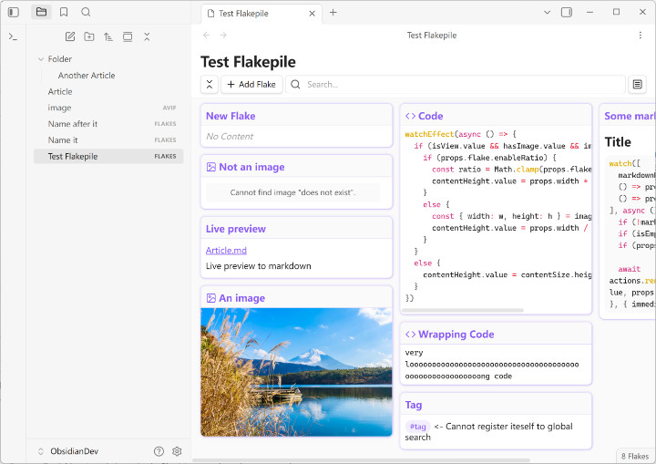

# Flakepiles for Obsidian

An Obsidian plugin to put small notes / stickies / cards in a dedicated file, and manage them in masonry layout.

A "flake" refers to a small piece of note, and a "flakepile" is a pile of those flakes.

Can be used to collect ideas, diaries, code snippets, and more.

*The preview image is in horizontal layout. You can change this to vertical layout.*



## Why

I don't want 100 `.md` files with 1 sentence each.

## Status

 The plugin is in early development, though basic features should now work properly. I've tested many cases I can think of, and [I myself am using it currently](https://en.wikipedia.org/wiki/Eating_your_own_dog_food), but please expect bug exists in corner cases.

## Installation

The plugin is not published as Obsidian's community plugin [yet](https://github.com/obsidianmd/obsidian-releases/pull/9533).

Please use [BRAT](https://github.com/TfTHacker/obsidian42-brat) to install the plugin, or copy the files under the release tag to the plugin folder of your Obsidian application. You can also [build it from source](#build-from-source).

## Tech Stack

Vite + Vue 3 + TypeScript + Sass

The underlying file format (`.flakes`) is JSON. See the [non-goals](#non-goals) section for explanation.

## Roadmap

Inside a flakepile:

- [x] Mount Vue into Obsidian
- [x] Flakepile
  - [x] Masonry layout
  - [x] Masonry direction (vertical / horizontal)
  - [x] (Sort of) mobile-adaptive layout
  - [x] Flake size
  - [x] Flake elastic sizing
  - [x] Flake sorting (name, time created, time modified)
- [x] Flake
  - [x] Flake creation, update, deletion
  - [x] Flake markdown rendering
  - [x] Text flake
  - [x] Image flake
  - [x] Code flake
- [x] Search filter inside a flakepile
- [ ] Flake labels
  - [ ] Label creation, update, deletion
  - [ ] Add / remove label to flake
  - [ ] Label color
  - [ ] Hide some labels (display as `+N`)
  - [ ] Label filtering
- [ ] Flake colors

Obsidian-wise:

- [x] "New flakepile" command & file menu option.
- [x] "Flake count" status bar item [1]
- Limited support to internal plugins
  - [x] Preview other markdown files via `[[file link]]`
  - [x] Jump to global search when clicking on a tag

[1] Due to the nature of this plugin, other status bar items are hidden in flakepile view. Please let me know if you think some status bar item should be displayed.

## Long term goals

- Search keywords highlighting
- Copy flake across flakepiles (the "copy raw" botton is for this)
- Export files to markdown files
  - Export as a single markdown file
  - Export as a `.zip` archive, each flake as a markdown file
- Import the `.zip` archive to a flakepile
- Import multiple markdown files to Flakes

## Non-goals

- Freedom / manual layout (consider using Canvas)
- Very large flakepile support (not the very intended way)
- Live editing of a flake (too complex)
- Cross-file searching / Obsidian-wise searching (restricted by API)
- Global search indexing (restricted by API)
- Unit testing (do not have enough time)

I recognize that this plugin is not so an Obsidian-style plugin, as it does not leverage markdown file like many other plugins do. On the other hand, this has the benefit of not having to juggle with black magics that makes a markdown file look like other layout (when the layout itself is quite complicated).

Also, this plugin is primarily to fulfill my specific need. For this reason, I would prioritize maintainability over adding unplanned features. I'm open to suggestions, though feature requests might be considered only when it's aligned to my own use case. 🙏

## Build from source

If you want to take a look inside the development of the plugin, or just want to ensure maximum safety, you can clone this repository and build from source:

```
npm i
npm run dev       // Watch mode, works with hot reload [1]
npm run build:dev // One-time dev build without minification
npm run build     // Build for production
```

[1] [Hot reload](https://github.com/pjeby/hot-reload)

WHen running `npm run build`, the output files will be copied to `dist` folder.

## Changelog

[Changelog for pre-1.0 versions](docs/changelog_pre1.0.md)

## License

MIT © i'DLisT 2026
